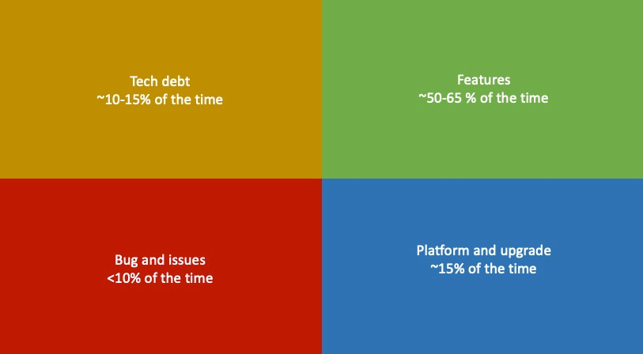

# Sprint Capacity Calculator

A non-ambitious Sprint Capacity Calculator to embed into Azure DevOps Dashboards.

# Proposal

In matter to have a healthy consumption of any backlog, a balance between developing features and paying debt or performing platform upgrades is mandated in any high-performance sprint team.
This calculator supports the team to find an ideal balance for the capacity distribution following the Value Areas below:

Following this distribution, it's guaranteed that every sprint a new increment will be released, as far as debts will be paid and upgrades will be performed.

# How it works

Each team should know, or guess by gut-feeling at the first time, its full sprint capacity. From there, they feed the calculator to find a good balance of where to invest effort for the upcoming sprint.

- Developers: The number of people that will actively work on tasks from the board, the ones that will develop the new increment.
- Full Capacity: The maximum capacity of the team for a single sprint, considering that all Developers will ve available full time for all days of the sprint.
- **Days off**: Number of days per developer that they will not be working on tasks from the board. Eg: Holidays, hackathons, meetings, working on tasks from another board.

## Example

Considering a Team has 8 people where:
- 4 backend engineers
- 1 frontend engineer
- 1 test engineer
- 1 product owner
- 1 engineering manager/scrum master

### To calculate the days off:

During the next sprint, let's consider:
- 1 public holiday
- 1 full day of the hackathon
- 1 engineer will be on vacation for a whole week
- 1 engineer will take a single day of sick leave

Calculating (only developer time matters):
- Due to public holiday: 1 day x 6 developers = 6 days off
- Due to hackathon (not working on any board tasks): 1 day x 6 developers = 6 days off
- Due to vacations: 5 days x 1 developer = 5 day off
- Due to sick leave: 1 day x 1 developer = 1 day off

**Total**: 6 + 6 + 5 + 1 = 18 days off

### For the calculation:

This calculator considers a sprint of 2 weeks in length, by that:
- 2 weeks x 5 days (per week) = 10 days per sprint
- 10 days per sprint x 6 developers = 60 developer days per sprint

Now we have the following inputs:
- Sprint Developer Days: 60
- Developers: 6 
- Full Capacity: 20 story points
- Days-off: 18

Summaryzing:
- Capacity Power: (60 dev days - 18 days off) / 60 Sprint development days = **70%**
- Capacity Points: 20 story points x 0.7 = **14 story spoints**

Distributing:
- Features: 14 x 0.6 = ~8 pts
- Technical debts and upgrades: ~4 pts
- Bugs: ~2 pts (buffer)

# Live test

https://nice-hill-072d06b03.1.azurestaticapps.net/

Arguments
- `developers`: number of developers in the Team
- `full-capacity`: team full capacity in story points
- `days-off`: number of developer days off for the sprint

### Example:

- https://nice-hill-072d06b03.1.azurestaticapps.net/?developers=6&full-capacity=40&days-off=0